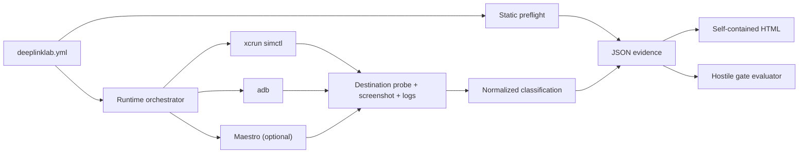
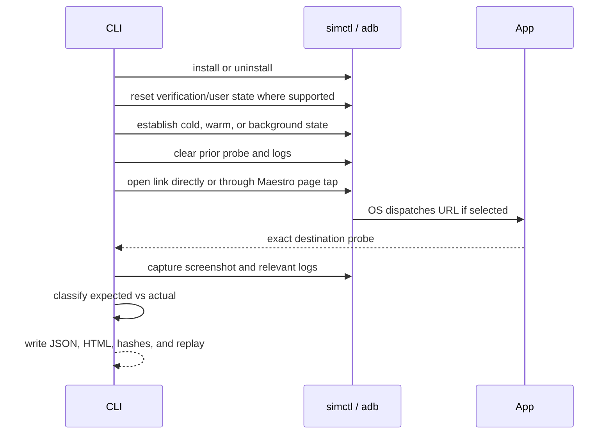

# Architecture

DeepLink Lab owns four things: the contract, static reasoning, normalized evidence, and classification. It deliberately delegates device behavior to tools maintained by the platform or established automation projects.

## Trust boundaries

Static preflight answers whether local configuration artifacts agree. It does not predict runtime success.

Runtime orchestration answers what the selected local Simulator or emulator visibly did from a declared starting state. It does not elevate that observation into a physical-device claim.

Destination probes are explicit:

- `ios_app_data_file` reads one relative file from the installed Simulator app data container;
- `android_run_as_file` reads one relative file from a debuggable emulator app through Android's `run-as` boundary;
- `log_regex` extracts capture group 1 from relevant device logs;
- `maestro_visible_text` treats a successful established UI assertion as the expected destination and otherwise leaves the destination unobserved.

Relative file probes reject absolute paths and `..`. The runner does not execute arbitrary probe shell commands.

## Case sequence

The app is never considered successful merely because an open command exited zero. `ObservationUnavailable` is a first-class result and a non-zero CLI outcome.

## Determinism

Stable inputs, ordered maps, declared state transitions, explicit resets, case-local evidence folders, and normalized classification make runs comparable. Wall-clock timestamps, durations, OS logs, and screenshot bytes naturally vary, so report files are evidence artifacts rather than byte-reproducible build outputs.

The repeatability gate compares normalized classifications per case. It uses the least stable case's modal agreement, avoiding an average that could hide a flaky route.

## Why no device driver

Deep-link dispatch, install state, verification state, browser behavior, accessibility, and screenshots already belong to Apple, Android, Maestro, and Appium. Reimplementing those surfaces would enlarge the trust boundary and create an unmaintainable compatibility claim. New adapters must normalize an established tool; they must not introduce a private input or gesture engine.
